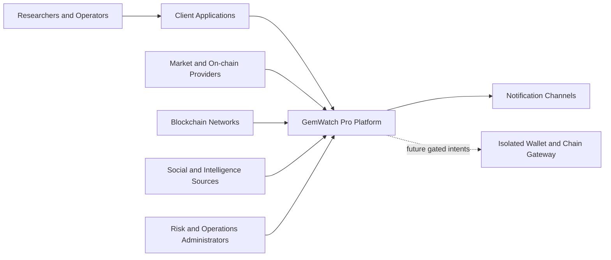
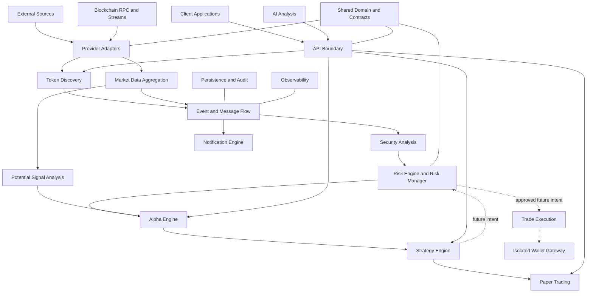
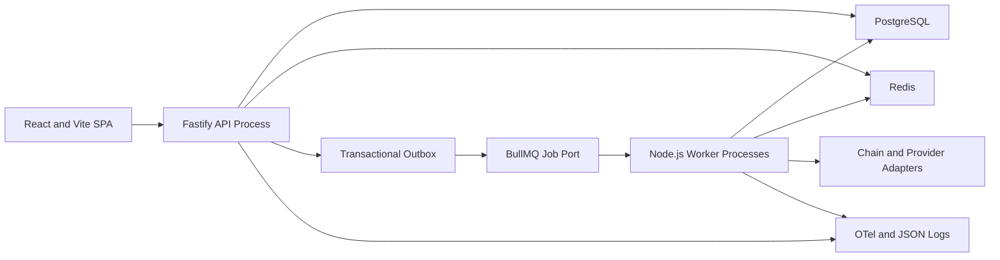
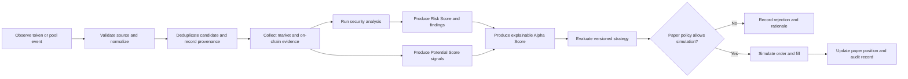

# Initial Architecture

## Status and Scope

This document combines technology-independent responsibilities with the initial implementation direction accepted in ADR-0002–ADR-0019. The backend begins as a TypeScript/Node.js modular monolith with a Fastify API and separately runnable workers. It does not select an initial chain/provider or imply that every module is separately deployed.

## Technology Mapping

| Architectural role | Initial direction |
| --- | --- |
| Web/API runtime | React/Vite SPA; Fastify on supported Node.js LTS |
| Domain/application | Framework/provider-independent TypeScript packages |
| Transactional data | PostgreSQL through Drizzle and reviewed SQL migrations |
| Ephemeral/jobs | Redis and BullMQ behind ports; PostgreSQL outbox/idempotency |
| External contracts | REST/OpenAPI and WebSocket; versioned events |
| Observability | OpenTelemetry traces/metrics and structured JSON logs |
| Identity | Cognito OIDC + PKCE; application-owned capability authorization |
| Local/CI | Native Node plus Compose infrastructure; GitHub Actions |
| AWS | Isolated Compose staging; ECS Fargate/managed-data production direction |

## System Context

External data, user identities, notification endpoints, and the future wallet gateway are trust boundaries. Every crossing requires validation, authentication where applicable, provenance, rate and failure handling, and least privilege.

## Component Responsibilities

- **Client applications:** React/Vite researcher and operator SPA; never direct database or wallet access.
- **API boundary:** Fastify REST/OpenAPI/WebSocket composition with authentication, authorization, validation, rate policy, contract versioning, and request correlation.
- **Token discovery:** detects candidate assets and liquidity events, deduplicates them, and retains source evidence.
- **Market data aggregation:** normalizes market and on-chain observations through provider adapters.
- **Security analysis:** derives contract, liquidity, holder, deployer, honeypot, rug, and related findings from corroborated evidence.
- **Risk engine:** calculates risk signals and policy decisions; the future Risk Manager is the mandatory execution gate.
- **Alpha engine:** combines versioned risk and potential evidence into explainable ranking signals.
- **Strategy engine:** evaluates approved strategy rules against versioned snapshots; it does not submit transactions.
- **Paper trading:** simulates orders, fills, fees, latency, liquidity, slippage, positions, and performance without real funds.
- **Trade execution:** future isolated conversion of approved intents into transactions; disabled and not implemented.
- **Notification engine:** sends policy-controlled, redacted, traceable alerts without implying guaranteed outcomes.
- **AI analysis:** optional advisory synthesis and explanation; no authority to approve, sign, or submit trades.
- **Shared domain layer:** provider/framework-neutral TypeScript identities, exact value objects, events, contracts, validation semantics, and versions.
- **Persistence:** PostgreSQL transactional truth, S3-compatible raw/archival objects when justified, and Redis only for ephemeral state.
- **Event/message flow:** BullMQ behind an internal port, PostgreSQL transactional outbox, at-least-once idempotent consumers, bounded retries, quarantine, ordering partitions, and safe replay.
- **Observability:** OpenTelemetry traces/metrics, structured JSON logs, health/alerts, data-quality signals, and separate audit correlation with redaction.
- **Infrastructure:** Docker Compose local/staging direction and ECS Fargate/managed AWS production direction with configuration, networking, backup, rollback, and recovery controls.

## High-Level Components

Dashed execution edges are future-only. The diagram does not permit Strategy or AI to call Trade directly.

## Initial Deployment Shape

API and workers are separate process roles from one modular codebase/artifact. Redis/BullMQ transport does not replace PostgreSQL business truth. Deployment topology can scale roles independently without turning modules into microservices prematurely.

## Discovery-to-Paper-Trade Flow

## Trust and Safety Boundaries

All external observations are untrusted. Chain/provider SDKs stay in adapters and never grant authority to a source. Cognito authenticates but application capabilities authorize. Administrative changes require stronger authorization/audit than reads. Research, paper, and live contexts remain separated. Wallet keys belong in a future dedicated boundary and never reach general services, clients, AI, telemetry, or Git. Risk Manager and emergency stop remain independent of strategy behavior.
