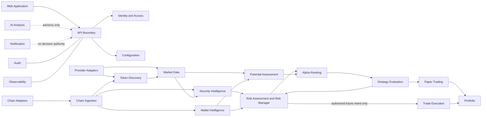

# System Boundaries

## Architectural Rule

The initial backend is a modular monolith. A bounded context is a code and data ownership boundary, not necessarily a separately deployed service. Cross-context calls use public application contracts or versioned events; private tables, provider SDKs, and framework objects are not public contracts.

## Identity and Access

- **Responsibility:** Authenticate identities, manage sessions, resolve roles/capabilities, enforce lockout, and expose authorization decisions.
- **Owned data:** Application user mapping, roles, capabilities, session references, revocations, and authentication audit links; credentials remain with Cognito.
- **Inputs:** OIDC assertions, session requests, administrative role changes.
- **Outputs:** Authenticated principal and capability decisions.
- **Public contracts:** Principal, SessionStatus, AuthorizationDecision, RoleChanged.
- **Forbidden dependencies:** Trade strategy, provider SDKs, wallet keys, and direct Cognito types outside its adapter.
- **Security classification:** Restricted identity and security-control data.
- **Scaling characteristics:** API-path latency sensitive; mostly stateless with shared session/revocation state.
- **Future extraction conditions:** Multiple tenants, independent identity team, regulatory isolation, or materially different availability needs.

## Configuration

- **Responsibility:** Validate, version, approve, and distribute non-secret operational and product configuration.
- **Owned data:** Configuration definitions, values, versions, activation windows, approvals, and change history.
- **Inputs:** Authorized changes and environment overlays.
- **Outputs:** Immutable ConfigurationSnapshot and ConfigurationChanged events.
- **Public contracts:** ConfigurationQuery, ConfigurationSnapshot, ConfigurationChanged.
- **Forbidden dependencies:** Direct secret values, provider SDK types, and silent live-trading enablement.
- **Security classification:** Internal; restricted for risk, wallet, or execution policy.
- **Scaling characteristics:** Read-heavy and cacheable; writes rare and strongly audited.
- **Future extraction conditions:** Independent release cadence, high-volume dynamic policy, or organizational ownership.

## Chain Ingestion

- **Responsibility:** Observe blocks/logs/transactions through chain adapters; handle confirmations, reorgs, retries, deduplication, and backfill.
- **Owned data:** Raw observation references, chain cursor/checkpoint, block lineage, provider request metadata, and ingestion status.
- **Inputs:** RPC/WebSocket adapter observations and backfill commands.
- **Outputs:** Canonical chain observation events with provenance.
- **Public contracts:** ChainObservation, BlockObserved, ReorgDetected, IngestionCheckpoint.
- **Forbidden dependencies:** Scoring, strategy, trading, provider SDK types beyond adapters, and direct user UI logic.
- **Security classification:** Untrusted external/raw data; operational checkpoints are internal.
- **Scaling characteristics:** I/O intensive, partitionable by chain/network/range, separately runnable workers.
- **Future extraction conditions:** Independent high throughput, chain-specific runtime, failure isolation, or specialist ownership.

## Token Discovery

- **Responsibility:** Identify and deduplicate candidate tokens and pools from normalized observations.
- **Owned data:** Discovery facts, candidate lifecycle, discovery evidence links, and deduplication keys.
- **Inputs:** Chain observations and DEX discovery adapter results.
- **Outputs:** TokenDiscovered and PoolDiscovered facts.
- **Public contracts:** AssetIdentity, PoolIdentity, DiscoveryEvidence, CandidateDiscovered.
- **Forbidden dependencies:** Raw provider SDK payloads, scores, strategy, paper/live execution.
- **Security classification:** Untrusted-derived public-chain intelligence.
- **Scaling characteristics:** Burst-oriented and idempotent; partitionable by chain.
- **Future extraction conditions:** Discovery volume or latency requires independent scaling.

## Market Data

- **Responsibility:** Collect, normalize, reconcile, and qualify prices, liquidity, volume, and market snapshots.
- **Owned data:** Normalized snapshots, provenance, quality/freshness indicators, and raw references.
- **Inputs:** Market/DEX/price-history adapters and discovery requests.
- **Outputs:** MarketSnapshotCollected and data-quality findings.
- **Public contracts:** MarketSnapshot, Quote, LiquidityObservation, DataQuality.
- **Forbidden dependencies:** Direct provider SDK types in public contracts, scoring formulas, or trade authorization.
- **Security classification:** Untrusted external market data and internal quality metadata.
- **Scaling characteristics:** High-write time series, provider/asset partitioning, backfill workers.
- **Future extraction conditions:** Independent ingestion scale, storage specialization, or provider isolation.

## Security Intelligence

- **Responsibility:** Analyze contract, liquidity, holder, deployer, honeypot, rug, and corroborated security evidence.
- **Owned data:** Security findings, evidence links, rule/model versions, confidence, and conflicts.
- **Inputs:** Normalized chain/market facts and security-provider adapter results.
- **Outputs:** SecurityAssessmentCompleted and findings.
- **Public contracts:** SecurityFinding, SecurityAssessment, EvidenceReference.
- **Forbidden dependencies:** A single provider verdict as authority, strategy, Trade Execution, or raw SDK payloads.
- **Security classification:** Sensitive decision-support data; external inputs untrusted.
- **Scaling characteristics:** CPU/I/O mixed, asynchronously parallelizable, version-replayable.
- **Future extraction conditions:** Specialized runtime, independent threat boundary, or sustained compute load.

## Wallet Intelligence

- **Responsibility:** Derive evidence-based wallet behavior, clusters, deployer history, whale, sniper, and MEV indicators.
- **Owned data:** Wallet observations, labels, cluster hypotheses, confidence, provenance, and version metadata.
- **Inputs:** Normalized chain facts and wallet-intelligence adapters.
- **Outputs:** WalletIntelligenceUpdated.
- **Public contracts:** WalletIdentity, WalletLabel, ClusterHypothesis, WalletEvidence.
- **Forbidden dependencies:** Unsupported real-world identity claims, direct trading, or raw provider coupling.
- **Security classification:** Sensitive behavioral data; PII minimized.
- **Scaling characteristics:** Graph/time-series heavy and backfill oriented.
- **Future extraction conditions:** Graph store/runtime need, privacy isolation, or independent compute scale.

## Risk Assessment

- **Responsibility:** Produce Risk Score and enforce the mandatory Risk Manager policy for every future execution intent.
- **Owned data:** Risk assessments, policy versions, limits, gate results, overrides, and decision explanations.
- **Inputs:** Versioned security, market, wallet, portfolio, configuration, and execution-intent snapshots.
- **Outputs:** RiskAssessmentCompleted and explicit ExecutionAuthorization or ExecutionDenied.
- **Public contracts:** RiskAssessment, RiskPolicy, ExecutionIntent, ExecutionAuthorization, ExecutionDenial.
- **Forbidden dependencies:** Provider SDKs, AI authority, direct wallet signing, or fail-open behavior.
- **Security classification:** Critical financial-safety control.
- **Scaling characteristics:** Low-latency policy path plus asynchronous assessment workloads; consistency prioritized.
- **Future extraction conditions:** Independent security boundary before live trading, separate approval ownership, or scaling evidence.

## Potential Assessment

- **Responsibility:** Produce explainable Potential Score signals from versioned non-authorizing evidence.
- **Owned data:** Potential features, score versions, uncertainty, explanations, and evaluation metadata.
- **Inputs:** Normalized market, chain, wallet, and social features.
- **Outputs:** PotentialAssessmentCompleted.
- **Public contracts:** PotentialAssessment, PotentialFeatureSet.
- **Forbidden dependencies:** Raw provider payloads, Trade Execution, or profitability claims.
- **Security classification:** Internal decision-support.
- **Scaling characteristics:** Batch/stream calculations, horizontally partitionable.
- **Future extraction conditions:** Dedicated analytical runtime or independent compute scale.

## Alpha Ranking

- **Responsibility:** Combine approved Risk and Potential signals into an explainable composite ranking, not an authorization.
- **Owned data:** Alpha score versions, ranking snapshots, inputs, uncertainty, and explanations.
- **Inputs:** Versioned Risk and Potential assessments.
- **Outputs:** AlphaScoreCalculated and ranked candidates.
- **Public contracts:** AlphaAssessment, RankingSnapshot.
- **Forbidden dependencies:** Provider raw payloads, direct Trade Execution, and guarantee language.
- **Security classification:** Internal decision-support.
- **Scaling characteristics:** Recomputable and batch/stream partitionable.
- **Future extraction conditions:** Independent ranking workloads or model lifecycle.

## Strategy Evaluation

- **Responsibility:** Evaluate versioned strategy rules against immutable evidence snapshots and request paper or future live intents.
- **Owned data:** Strategy definitions, versions, evaluations, rationales, and requested intents.
- **Inputs:** Alpha/risk/market/configuration/portfolio snapshots.
- **Outputs:** StrategyEvaluated and ExecutionIntent; never an executable order.
- **Public contracts:** StrategyDefinition, StrategyDecision, ExecutionIntent.
- **Forbidden dependencies:** Direct Trade Execution, wallet keys, AI authorization, provider SDKs.
- **Security classification:** Restricted financial-decision logic.
- **Scaling characteristics:** Deterministic/replayable, partitionable by strategy and asset.
- **Future extraction conditions:** Independent strategy ownership, compute isolation, or different release cadence.

## Backtesting

- **Responsibility:** Replay versioned data and strategies with controlled time, fees, slippage, liquidity, and bias checks.
- **Owned data:** Dataset manifests, run configuration, results, seeds, assumptions, and validation findings.
- **Inputs:** Historical immutable datasets and versioned strategies/scores.
- **Outputs:** BacktestCompleted and evidence reports.
- **Public contracts:** BacktestRun, DatasetManifest, BacktestResult.
- **Forbidden dependencies:** Live providers, future data, wallet signing, or direct promotion to live trading.
- **Security classification:** Internal research data.
- **Scaling characteristics:** CPU/data intensive batch workload.
- **Future extraction conditions:** Independent compute platform or large historical workloads.

## Paper Trading

- **Responsibility:** Simulate order lifecycle, fills, fees, positions, portfolio, reconciliation, and incidents without broadcasting transactions.
- **Owned data:** Paper orders, fills, balances, positions, runs, and reconciliation state.
- **Inputs:** Paper execution intents, market snapshots, and paper risk/configuration policies.
- **Outputs:** PaperOrderRequested, PaperOrderExecuted, PaperPositionChanged.
- **Public contracts:** PaperOrder, PaperFill, PaperPortfolioSnapshot.
- **Forbidden dependencies:** Wallet keys, blockchain broadcast, live order tables, or shared live execution adapters.
- **Security classification:** Restricted simulation data; explicitly non-live.
- **Scaling characteristics:** Event-driven and deterministic replay capable.
- **Future extraction conditions:** Independent simulation scale or stronger environment isolation.

## Trade Execution

- **Responsibility:** In a future phase only, convert a valid, fresh Risk Manager authorization into an isolated transaction workflow.
- **Owned data:** Future execution attempts, simulations, approvals, signed-reference metadata, reconciliation, and outcomes.
- **Inputs:** ExecutionAuthorization issued by Risk Assessment/Risk Manager; never a raw strategy or AI request.
- **Outputs:** ExecutionAttempted, ExecutionSubmitted, ExecutionConfirmed, ExecutionFailed.
- **Public contracts:** ExecutionAuthorization, TransactionPlan, ExecutionResult.
- **Forbidden dependencies:** Direct AI Analysis, Notification, strategy bypass, general provider SDKs, or unisolated keys.
- **Security classification:** Critical/restricted; disabled and not implemented.
- **Scaling characteristics:** Low volume initially, strong consistency and isolation over throughput.
- **Future extraction conditions:** **Mandatory independent execution/security boundary before any live trading.**

## Portfolio

- **Responsibility:** Maintain authoritative paper and future live positions, exposure, valuation references, and reconciliation while keeping contexts distinct.
- **Owned data:** Position/lot/valuation/exposure snapshots and reconciliation records.
- **Inputs:** Paper fills or future confirmed live outcomes plus qualified market data.
- **Outputs:** PortfolioChanged and exposure snapshots.
- **Public contracts:** Position, ExposureSnapshot, PortfolioSnapshot.
- **Forbidden dependencies:** Provider raw payloads, unconfirmed execution intents, or merging paper/live ledgers.
- **Security classification:** Restricted financial state.
- **Scaling characteristics:** Transactional consistency and read models; partitionable by portfolio.
- **Future extraction conditions:** Multi-user scale or independent ledger controls.

## Notification

- **Responsibility:** Deliver redacted, policy-approved alerts and track delivery/acknowledgement.
- **Owned data:** Notification requests, channel policies, delivery attempts, and acknowledgement.
- **Inputs:** Versioned notification events from other contexts.
- **Outputs:** Delivery results.
- **Public contracts:** NotificationRequested, NotificationDelivered, NotificationFailed.
- **Forbidden dependencies:** Trade decisions, strategy mutation, wallet access, or unredacted secrets.
- **Security classification:** Internal with potentially sensitive summaries.
- **Scaling characteristics:** I/O bound, retryable per channel, separately scalable.
- **Future extraction conditions:** Channel volume, provider isolation, or independent availability.

## AI Analysis

- **Responsibility:** Provide grounded summaries, explanations, and advisory analysis with model/prompt provenance.
- **Owned data:** AI requests, grounded references, model/prompt versions, evaluations, outputs, and safety findings.
- **Inputs:** Approved redacted evidence and explicit user/application requests.
- **Outputs:** AdvisoryAnalysisCompleted.
- **Public contracts:** AdvisoryAnalysisRequest, AdvisoryAnalysisResult.
- **Forbidden dependencies:** Trade Execution, wallet operations, secrets, raw untrusted prompt authority, or independent action approval.
- **Security classification:** Restricted and adversarial-input exposed.
- **Scaling characteristics:** External-latency/cost bound and asynchronously scalable.
- **Future extraction conditions:** Independent security, cost, model, or data residency requirements.

## Audit

- **Responsibility:** Append tamper-evident records for decisions, changes, approvals, safety gates, and sensitive operations.
- **Owned data:** Immutable audit events, actor/service identity, correlation, versions, evidence references, and integrity metadata.
- **Inputs:** Audit-worthy events from every context.
- **Outputs:** Restricted queries, exports, integrity and retention reports.
- **Public contracts:** AuditRecordRequested, AuditRecord, AuditIntegrityFinding.
- **Forbidden dependencies:** Normal user update/delete paths, secrets, or mutable domain tables as the sole audit record.
- **Security classification:** Critical restricted evidence.
- **Scaling characteristics:** Append-heavy, retention/partition/archive driven.
- **Future extraction conditions:** Compliance isolation, immutable storage, independent access controls, or high volume.

## Observability

- **Responsibility:** Collect operational logs, metrics, traces, health, freshness, lag, and alerts without replacing audit.
- **Owned data:** Telemetry configuration, derived health state, alert rules, and operational dashboards; telemetry backend retains signals.
- **Inputs:** Allowlisted telemetry from all components and infrastructure.
- **Outputs:** Alerts, health/readiness, dashboards, and diagnostic correlations.
- **Public contracts:** HealthStatus, ReadinessStatus, OperationalAlert.
- **Forbidden dependencies:** Business authorization, secret/raw payload capture, or mutation of audited decisions.
- **Security classification:** Internal; restricted when containing topology or incident context.
- **Scaling characteristics:** High-volume append/aggregation with sampling and retention.
- **Future extraction conditions:** Dedicated operations platform, independent scale, or backend migration.

## Locked Dependency Rules

- Trade Execution cannot generate or submit an order without a fresh Risk Manager ExecutionAuthorization.
- AI Analysis cannot call Trade Execution directly or indirectly authorize it.
- Provider and chain SDKs remain inside adapters.
- The web application accesses data only through authenticated APIs, never the database.
- Notification cannot decide or alter trades.
- Scoring contexts consume normalized/versioned features, never provider raw payloads directly.
- Audit records cannot be changed through normal user operations.
- Paper Trading and Trade Execution use separate contracts, stores/ledgers, credentials, queues, and runtime policy boundaries.

## Dependency Diagram

